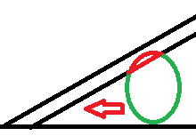

# Shooting system:
- Sistemul de coliziuni din unity nu detecteaza coliziunile cand obiectele se misca extrem de repede (problema in cazul gloantelor)
- Gloantele trec prin obiecte atunci cand arma se afla in obiectul respectiv.

# Throwing system:
- Cand faci un obiect copilul unui alt obiect, scale-ul si rotatia parintelui distorsioneaza copii, problema pentru a avea cutitele infipte de obiecte care se misca (Posibil sa poata fi reparat cu fixed joints)

# Movement: 

<ul><li>Cand dai dash sub un collider slope, player-ul poate ramane cateva secunde blocat in acel collider:</ul>

# Rewind:
- Mare grija cu variabilele setate din editor la o anumita valoare
- Ex: Daca creati un moment nou in timp ce un enemy te urmarea, in timp ce te urmarea, enemy avea variabila ‘isChasingPlayer’ setata ca true
- Daca ai fi creat un moment nou, corutina de Chase a enemy-ului nu ar mai fi existat si nu ar fi avut cum sa ajung la final pentru a seta variabila isChasingPlayer ca si true, deci enemy-ul ramanea permanent in Chase. Am reparat bug-ul prin a seta isChasingPlayer ca fiind false in Start()
